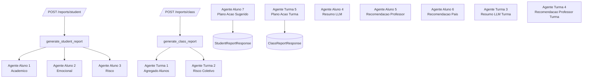
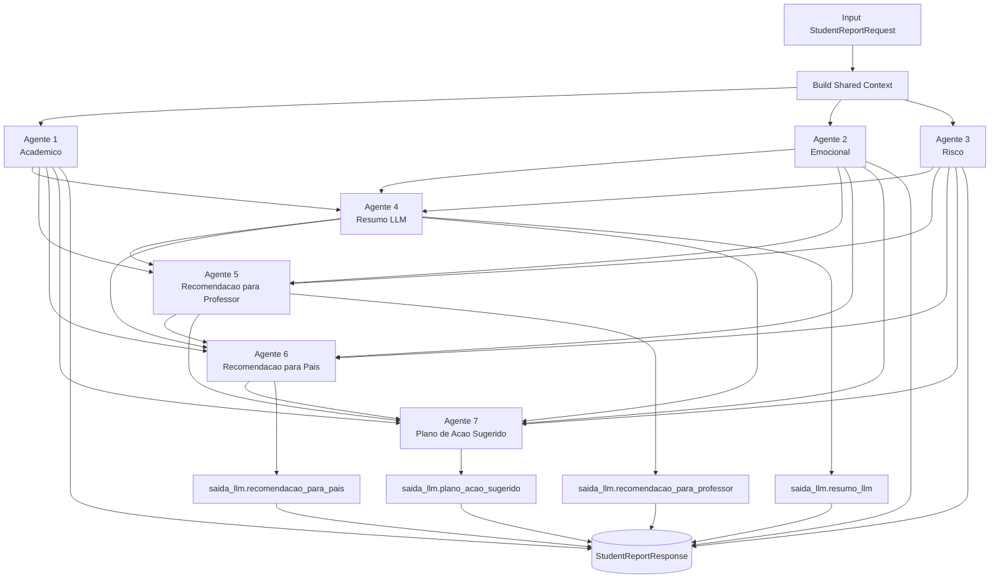
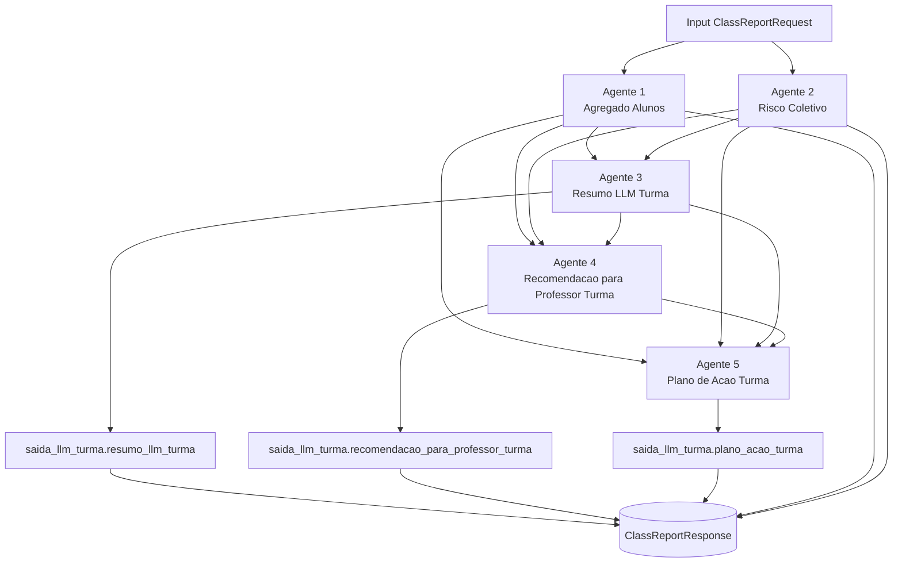

# Arquitetura de Agentes

Este documento descreve os fluxos reais dos agentes usados atualmente no sistema.

## Visao Geral de Orquestracao

## Fluxo Completo - Relatorio de Aluno

Representacao textual:

1. Agentes de analise base: Academico, Emocional e Risco.
2. Resumo LLM recebe a saida dos 3 agentes base.
3. Recomendacao para Professor recebe os 3 agentes base + Resumo LLM.
4. Recomendacao para Pais recebe os 3 agentes base + Resumo LLM + Recomendacao Professor.
5. Plano de Acao Sugerido recebe todos os agentes anteriores.
6. A resposta final inclui academico, emocional, risco e saida_llm consolidada.

## Fluxo Completo - Relatorio de Turma

Representacao textual:

1. Agregado Alunos e Risco Coletivo sao os agentes base.
2. Resumo LLM Turma recebe Agregado Alunos + Risco Coletivo.
3. Recomendacao para Professor Turma recebe Agregado Alunos + Risco Coletivo + Resumo LLM Turma.
4. Plano de Acao Turma recebe todos os agentes anteriores.
5. A resposta final inclui agregado_alunos, risco_coletivo e saida_llm_turma consolidada.

## Observacoes

- Todos os agentes sao executados com chamadas independentes a OpenAIClient.generate.
- A orquestracao atual e sequencial por dependencias de contexto entre os agentes.
