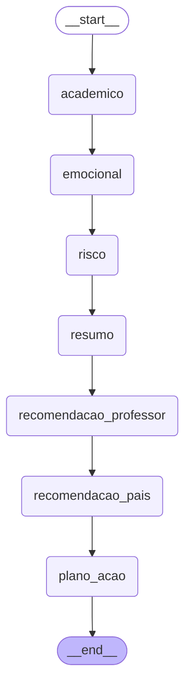
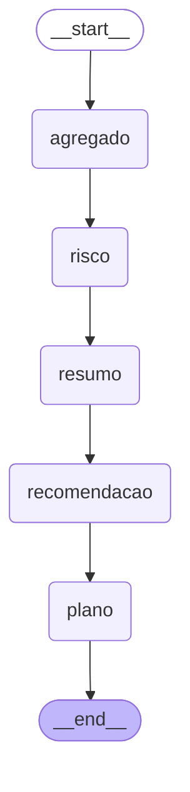

# LangGraph Gerado Automaticamente

Este arquivo e gerado por scripts/generate_langgraph_diagrams.py.

## Student Report Graph

```mermaid
---
config:
  flowchart:
    curve: linear
---
graph TD;
	__start__([<p>__start__</p>]):::first
	academico(academico)
	emocional(emocional)
	risco(risco)
	resumo(resumo)
	recomendacao_professor(recomendacao_professor)
	recomendacao_pais(recomendacao_pais)
	plano_acao(plano_acao)
	__end__([<p>__end__</p>]):::last
	__start__ --> academico;
	academico --> emocional;
	emocional --> risco;
	recomendacao_pais --> plano_acao;
	recomendacao_professor --> recomendacao_pais;
	resumo --> recomendacao_professor;
	risco --> resumo;
	plano_acao --> __end__;
	classDef default fill:#f2f0ff,line-height:1.2
	classDef first fill-opacity:0
	classDef last fill:#bfb6fc

```

## Class Report Graph

```mermaid
---
config:
  flowchart:
    curve: linear
---
graph TD;
	__start__([<p>__start__</p>]):::first
	agregado(agregado)
	risco(risco)
	resumo(resumo)
	recomendacao(recomendacao)
	plano(plano)
	__end__([<p>__end__</p>]):::last
	__start__ --> agregado;
	agregado --> risco;
	recomendacao --> plano;
	resumo --> recomendacao;
	risco --> resumo;
	plano --> __end__;
	classDef default fill:#f2f0ff,line-height:1.2
	classDef first fill-opacity:0
	classDef last fill:#bfb6fc

```
